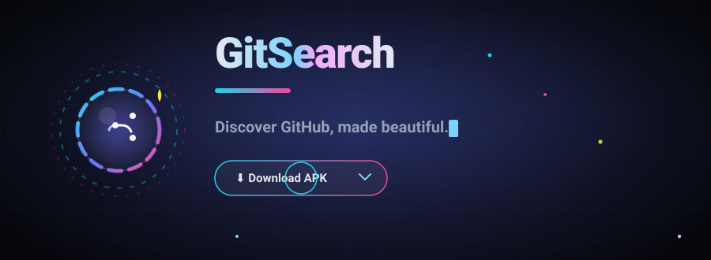
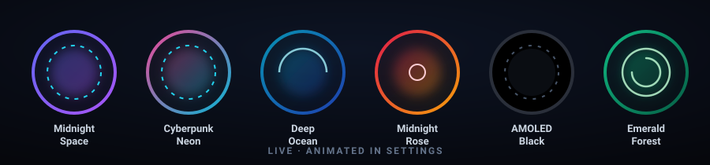

<p align="center">
  
</p>

<br/>

<p align="center">
  <a href="https://github.com/rkkizar777-design/git.store.apk/releases/latest"></a>
  <a href="https://github.com/rkkizar777-design/git.store.apk/releases"></a>
  <a href="https://github.com/rkkizar777-design/git.store.apk/releases"></a>
</p>

<p align="center">
  
  
  
  
  
  
</p>

<br/>

<p align="center">
  <a href="#-what-is-gitsearch"><b>What is it</b></a> ·
  <a href="#-the-problem-it-solves"><b>The Problem it Solves</b></a> ·
  <a href="#-live-tour"><b>Live Tour</b></a> ·
  <a href="#-six-color-themes-in-motion"><b>Themes</b></a> ·
  <a href="#-features"><b>Features</b></a> ·
  <a href="#-install"><b>Install</b></a> ·
  <a href="#-privacy--security"><b>Privacy</b></a> ·
  <a href="#-build-from-source"><b>Build</b></a>
</p>

---

<br/>

## ✨ What is GitSearch?

**GitSearch Mobile** is a pocket GitHub companion for Android that turns the raw, slow, login-first web into a beautiful, instant, and completely private discovery experience.

- 🔍 **Search all of GitHub instantly** — no account, no login, no waiting
- 🔥 **A discovery home** — For You feed, Pick Your Vibe, Project Threads with comments, and curated categories, ready before you even type
- 📖 **Read any README** in a gorgeous reader mode — right inside the app
- 📥 **In-app updates** — downloads run inside the app with a live progress bar, then install on their own
- 🕶️ **Six animated dark themes** you can switch live, from AMOLED black to Cyberpunk Neon
- 🔐 **Lock it down** with a 4-digit PIN or your fingerprint/face — like a vault for your repos
- 💬 **Peer-to-peer GitChat** — share repos with people around you, no server in between
- 🔔 **Push-style notifications** when a new version ships, and **one-tap self-update** from this very release page

> One APK. ~6.9 MB. No sign-up. No server. No tracking. Ever.

<br/>

## 🧩 The Problem It Solves

Let's be honest about how exploring GitHub feels on a phone today:

| 😩 The pain | ❌ The official app | ❌ The mobile browser | **✅ GitSearch** |
|---|---|---:|---:|---:|
| **"I just want to search, not sign in"** | Requires a GitHub account | Works, but heavy and slow | **Instant, zero login** |
| **"Where do I start?"** | No discovery surface — you must know what to look for | Random links or bookmarks | **For You + Trending + categories on open** |
| **"I can't read this README on my phone"** | No reader mode | Tiny fonts, broken tables | **Native markdown reader with cached images** |
| **"My data is being collected"** | Analytics everywhere | Trackers, ads, cookie walls | **100% client-side. Zero telemetry.** |
| **"It looks like 2010"** | Functional, not beautiful | Cluttered | **Six curated dark themes, animated** |
| **"I forgot which repo I saved"** | Cloud-synced to your account | Bookmarks in a browser | **Offline local bookmarks + badges** |
| **"Am I on the latest version?"** | App-store update noise | N/A | **In-app update detector + 1-tap install** |

**GitSearch exists so you can discover, read, bookmark, and share GitHub — the way a great product should feel: instant, private, and beautiful.** No account. No tracking. No middleman.

<br/>

## 📱 Live Tour

> _This is a live animation, not a static screenshot — the app looks exactly like this._

<p align="center">
  
</p>

Watch it: type a search → repo cards slide in with stars and forks → tap one and the **README sheet glides up** in reader mode → jump anywhere with the bottom nav.

<br/>

## 🎨 Six Color Themes, In Motion

<p align="center">
  
</p>

| | Theme | Vibe | Why you'll love it |
|---|---|---|---|
| 🌌 | **Midnight Space** *(default)* | Ice Cyan → Indigo → Magenta | The flagship look — deep space with neon edges |
| ⚡ | **Cyberpunk Neon** | Hot Pink → Electric Cyan | For the ones who like their apps loud |
| 🌊 | **Deep Ocean** | Aqua Teal → Deep Blue | Calm, focused, oceanic |
| 🌹 | **Midnight Rose** | Ruby Red → Amber Glow | Warm and dramatic |
| 🖤 | **AMOLED Black** | True pure black | Saves battery on OLED screens |
| 🌲 | **Emerald Forest** | Mint Green → Forest | Fresh and grounded |

Switch instantly in **Settings → Appearance** from a swatch picker — no restart needed.

<br/>

## 📊 Live Dashboard

<p align="center">
  
</p>

Every release is **pushed straight to this repository** and the app detects it, notifies your phone, and installs the update in one tap — no store, no approval queue, no middleman.

<br/>

## 🚀 Features

### 🔭 Discovery First
- **For You** — a smart feed mixed from GitHub trending, your top searches, and surprise picks
- **Pick Your Vibe** — a big swipeable card (👍 / 👎) that personalizes the feed in seconds
- **Project Threads** — bigger repo cards with the README overview plus **live discussions & comments** right on the home screen; tap a comment to read the full conversation
- **Continue Reading** — your recently opened repos, ready to jump back into
- **🔥 Trending** — the week's hottest repos on GitHub, one tap away
- **10 quick categories** — AI/ML, Web Dev, Rust, APIs, Python, Mobile, Games, Security, DevOps, and more

### 🔍 Search & Browse
- Smart search with **inline history suggestions** and one-tap delete
- Sort by **⭐ Stars · 🍴 Forks · 🕐 Recently updated**
- **Infinite scroll** — results keep loading as you scroll
- Language dots, topic tags, and license badges at a glance
- **Results per page** 15 / 30 / 50 — your call

### 📖 README Reader Mode
- Full **markdown rendering** — code blocks, tables, images, blockquotes
- **Cached images** so it stays fast offline
- **Share any repo** straight from the reader sheet

### 💬 Peer-to-Peer GitChat
- Broadcast and receive repo links with nearby devices
- **No server, no relay, no account** — just you and the people you share with

### 🔖 Offline Bookmarks & More
- Save repos **permanently on-device** — no sign-in, all private
- **Achievements** for daily streaks 🏆
- **Home-screen widget** for one-tap trending
- **Scan & share QR codes** for any repo

### 🔐 Security
- App lock with **4-digit PIN** and/or **fingerprint / face unlock** (biometric only mode)
- "Vault" behavior: the app locks itself, your repos stay yours

### 🔔 Self-Updating
- Flashing alert when a new version is found
- Rich notification with the version + first change; tap to install
- **In-app download** — the APK downloads right inside the app with a live progress bar (percent + MB), then the installer opens automatically — no jumping to GitHub
- If Android blocks the install, the update screen walks you to "Allow installs for GitStore" and brings you back to install
- Cross-verified against this release page — a stale cache can never hide a new release

<br/>

## 📥 Install

<p align="center">
  <a href="https://github.com/rkkizar777-design/git.store.apk/releases/latest">
    
  </a>
</p>

```
1.  Tap "Download APK" — you'll land on the latest release page
2.  Download the attached gitsearch.apk (only ~6.9 MB)
3.  Open the file → allow "Install from unknown sources" if prompted
4.  Launch GitSearch → pick your theme → start discovering
```

> **Already installed?** The app detects new versions here automatically and notifies you. Just tap **Update** in the app — no re-download hunting.

**Requirements:** Android 6.0 (API 23) or higher.

<br/>

## 🛡️ Privacy & Security

| Guarantee | How |
|---|---|
| 🔒 **Zero tracking** | No analytics, no telemetry, no cookies, no fingerprinting |
| 💾 **Local only** | Bookmarks, history, profile and theme stay on *your* device |
| 🌐 **Direct & encrypted** | Every request goes straight to `api.github.com` over HTTPS |
| 🚫 **No backend** | No relay server, no proxy, no middleman — nothing to subpoena |
| 🔐 **App lock** | Optional PIN + biometric protection for the app itself |

We cannot track you because **there is nothing to track you with**. That is the whole point.

<br/>

## ⚙️ Build From Source

> **Prerequisites:** Node.js 18+, JDK 17+, Android Studio + Android SDK

```bash
# Clone
git clone https://github.com/YOUR_USERNAME/GitSearch-Mobile.git
cd GitSearch-Mobile

npm install          # install dependencies
npm run dev          # preview in the browser

npm run build        # build the web bundle
npx cap sync android # sync to the native project
cd android
.\gradlew.bat assembleDebug   # compile the APK
# → android/app/build/outputs/apk/debug/app-debug.apk
```

<br/>

## ❓ FAQ

<details>
<summary><strong>Do I really not need an account?</strong></summary>
<br/>
Correct. Search, browse, read READMEs, bookmark, share and chat — all without any GitHub account. The public API needs none for search.
</details>

<details>
<summary><strong>Is it actually private?</strong></summary>
<br/>
Yes. The APK contains no analytics SDK. All data lives in your device storage. The only network calls are yours, to GitHub's public API.
</details>

<details>
<summary><strong>How do updates work without the Play Store?</strong></summary>
<br/>
The app reads this repository's release feed. When a new tag appears it notifies you (rich notification). Tap **Download & install** and the APK downloads right inside the app with a live progress bar, then installs on its own. It cross-checks with the release page so it never misses an update.
</details>

<details>
<summary><strong>Why isn't this on the Play Store?</strong></summary>
<br/>
A GitHub-focused app doesn't need a store queue between you and the next improvement. Direct releases mean faster updates, no approval lag, and total control — for us *and* for you.
</details>

<details>
<summary><strong>How do I update once installed?</strong></summary>
<br/>
Tap the pulsing update indicator in the app, or go to the **Updates** screen and hit "Check for updates". GitSearch will confirm the latest version, download it **inside the app** with a progress bar, and install it in one tap.
</details>

<br/>

## 👨‍💻 Credits

<div align="center">

| | |
|---|---|
| **Maker** | **Kizar** |
| **Support** | [rkkizar777@gmail.com](mailto:rkkizar777@gmail.com) |
| **Telegram** | [@gitsearch1](https://t.me/gitsearch1) |
| **Stack** | React 18 · Capacitor 6 · GitHub REST API v3 · Android |
| **License** | [GitStore Proprietary License](LICENSE) |

</div>

<br/>

<p align="center">
  <sub><b>Discover GitHub, made beautiful.</b></sub><br/>
  <sub>Built with ❤️ by <b>Kizar</b> · 100% client-side · zero tracking</sub>
</p>

<p align="center">
  
</p>

